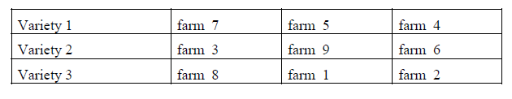
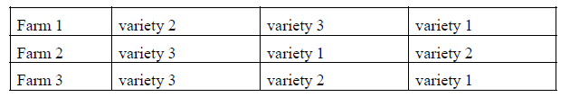
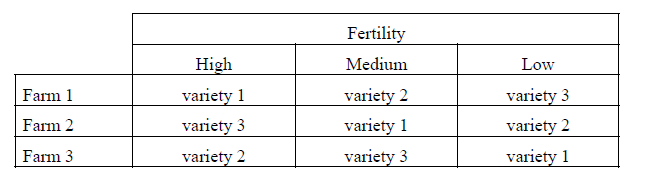

# 512

## Basics

### Random vs. Fixed 

A factor is __random__ if its levels represent a random sample from a population consisting of a large number of possible levels. 

A factor is __fixed__ if its levels are selected by a non-random process or if its levels consist of the entire population of possible levels. 

### Crossed vs. Nested

A factor, A, is said to be __crossed__ with respect to a second factor, say B, if each level of factor A is exactly the same for each level of factor B, and each level of factor B is exactly the same for each level of factor A. 

Otherwise, the factor is said to be __nested__. A factor, say B, is __nested__ within another factor, say A, if the levels of factor B are __not__ the same across all levels of factor A. 

## Completely randomized designs

__Completely random design (CRD)__: 

__All experimental  units__ are __randomly assigned__ to all treatment combinations and therefore the design is a CRD design. That is, across all experimental units, they are assumed to be homogeneous before getting the assigned treatments assigned.

 

This is __Completely Randomized Design__. That is, we have a __one-way treatment structure__ (Variety) in a __completely randomized design structure__. Note that the experimental unit (Farm) is __nested__ within treatment (Variety).

## Randomized complete block designs

__Randomized complete block design (RCBD)__: 

Suppose there are __t-treatments__, with each to be observed __b times__, so that $b\times t$ experimental units are necessary. An RCBD arranges the $b\times t$ experimental units into $b$ homogeneous groups (blocks) with each containing t base units. 

The $t$ treatments are randomly assigned to the $t$ units within each block so that each treatment appears once with a block. 

 

This is a __Randomized Complete Block Design__. That is, we have a one-way treatment structure (Variety) in a randomized complete block design structure. 

We call the __farms__ blocks or __blocking factor__. Note that block and treatment (Variety) are crossed.

## Incomplete block designs

_512 P. 293_

These designs are similar to the RCBD except that each block (e.g., each farm) contains fewer than $t$ units and thus, only a portion of the $t$ treatments are applied to the units within each block. (e.g., not all the farms will get all the varieties of wheat).

## Row-column design (Latin square designs)

( __My own short summary:__ Latin Square Designs basically are a double-block design.)

This design is a form of double blocking. Suppose there are t treatments of interest and t2 experimental units that are arranged in t rows which intersect with t columns. The experiment units of the rows form a homogeneous structure (block), as do the columns. As with the RCBD, each row (block) receives all t treatments, as with each column (block).

__Example:__

Randomly select 3 farms and divide each farm into 3 subunits with all three Varieties to be assigned to each farm. 

Suppose however, that these farms have fertility gradients (high, medium and low) which may influence the response (yield). The subunits in each farm might be arranged in order of their fertility level. The treatments are assigned so that each farm (row) receives all three Varieties, but so does each fertility (column) level. 

This arrangement might appear as in the following table.

This is a __Latin Square Design__. That is, we have blocked both on __rows (farms)__ and __columns (fertility)__ such that each treatment occurs once, and only once, within a row or column (e.g., a block). 

Again, treatments are arranged in a __one-way treatment structure__. Note that the rows and columns are crossed factors and also crossed with the treatment (Variety).

## Split-plot designs

( __My own short summary:__ The split-plot design is a bit similar to Latin Square Designs, but not exactly the same.)

Consider a completely randomized design with a one-way treatment structure. In this case, suppose the treatment structure consists of 3 variteis of wheat ($V_1,V_2,V_2$), each planted on 4 randomly selected farms. 

The ANOVA table for this experiment would appear as follows. As shown, __farms__ are nested within __Variety__. As we can see, we do not need to model specifically the __variety__ within each farm. 

__Whole Plot and Treatment Structure__

However, now suppose that the researcher is also interested in the effect of two different fertilizers ($F_1, F_2$) on yield. The completely randomized design can be modified by __splitting__each farm in half. In this experiment, there are two different sizes of experimental units: the large units, which are the farms and the small units, which are the Farm Halves (i.e., fertility levels).

__Sub-plot Design and Treatment Structure__

_Split plot vs split block design__

_See 512 P.363_

