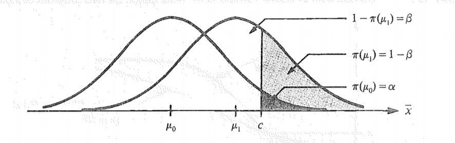
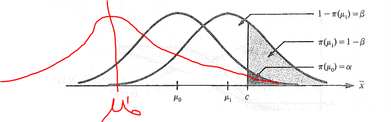

# 556 Chapter 12

## 12.1

### THeory

If $X \sim f(x;\theta)$, a __statistical hypothesis__ is a statement about the distribution of $X$. If the hypothesis completely specifies $f(x;\theta)$, then it is referred to as a __simple hypothesis__; otherwise it is called __composite__.

Quite often the distribution in question has __a known parametric form__ with a single unknown parameter $\theta$, and the hypothesis consists of a statement about $\theta$. 

In this framework, a statistical hypothesis corresponds to a subset of the parameter space, and the objective of a test would be to decide whether the true value of the parameter is in the subset. Thus, a null hypothesis would correspond to a subset $\Omega_0$ of $\Omega$, and the alternative hypothesis would correspond to its complement, $\Omega-\Omega_0$

In the case of __simple hypothesis__, these sets consist of only one element each, $\Omega_0=\{ \theta_0\}$ and $\Omega -\Omega_0=\{ \theta_1\}$, where $\theta_0 \neq \theta_1$.

We now must consider sample data, and decide on the basis of the data whether we have sufficient statistical evidence to reject $H_0$ in favor of the alternative $H_a$, or whether we do not have sufficient evidence.

That is, our philosophy will be to divide the sample space into two regions, the "critical region" or "rejection region" $C$, and the nonrejection region $S-C$. If the observed sample data fall in $C$, then we will reject $H_0$.

$\bar{X}$ is a sufficent statistic for $\mu$, so we may conveniently express the critical region directly in terms of the univariate variable $\bar{X}$, and we will refer $\bar{X}$ as the test statstic. Because $\mu_1 > \mu_0$, a natural form for the critical region in this problem is to let $C=\{ (x_1,..., x_n) | \bar{x} \geq c\}$, for some appropriate constant $c$. That is, we will reject $H_0$ if $\bar{x} \geq c$, and we not reject $H_0$ if $\bar{x} < c$.

There are two possible error:

1. Type I error: reject a true $H_0$. $P[Type I error]=\alpha$.

2. Type II error: fail to reject a false $H_0$. $P[Type II error]=\beta$.


Note that, $P[Type I error]=\alpha$ is also referred to as the __significance level__ of the test. 


### Example

For instance, if $n=25$, then $\alpha=0.05$ gives

$$c=\mu_0+Z_{1-\alpha}\sigma/\sqrt{n}=10+1.645 \cdot 4/5=11.316$$.

We can verify as follows.

$$\begin{aligned} P[\bar{X}\geq c | \mu=\mu_0=10] &=P[\frac{\bar{X}-\mu_0}{\sigma/\sqrt{n}} \geq \frac{c-\mu_0}{\sigma/\sqrt{n}}] \\ &=P[Z \geq \frac{11.316-10}{4/5}] \\&=P[Z\geq 1.645] \\&=0.05 \end{aligned}$$

Thus, a size $0.05$ test of $H_0: \mu=10$ against the alternative $H_a:\mu=11$ is to reject $H_0$ if the observed value $\bar{X} \geq 11.316$.


Note that, the calculation of $C$ has nothing to do with the alternative. However, $c$ impacts type II error:

$$\begin{aligned} \beta=P[TII] &=P[\bar{X}<11.316 |\mu=\mu_1=11] \\ &=P[\frac{\bar{X}-11}{4/5}<\frac{11.316-11}{4/5}] \\ &=P[Z <0.395] \\ &=0.645 \end{aligned}$$

__My personal note__:

(1) $C$ is only determined by $H_0$, but the choose of $C$ can impact type II error. The basic idea of the calculation a region where the probability there will be $0.05$. And if the observed mean falls into that region, we can reject $H_0$. 

(2) Type II error is to calculate the __probability__ that __NOT__ in the __critical region__ defined by __null hypothesis__. 


Thus, we can set another critical area to illustrate this.

$$P[10 < \bar{X}<10.1006]=P[0 <\frac{\bar{X}-10}{4/5} <0.1257]=0.05$$

However, $P[Type II error]$ for this critical regiion is:

$$\begin{aligned} P[TII] &=1-P[10<\bar{X}<10.1006|\mu=11] \\ &=1-P[\frac{10-11}{4/5}<Z<\frac{10.1006-11}{4/5}] \\ &=1-P[-1.25 <Z<-1.12425] \\ &=0.9752 \end{aligned}$$

Thus, this critical region is much worse than using the right-hand tail of the distribution of $\bar{X}$ under $H_0$.

If we increase the sample size from 25 to 100, we can reduce the Type II error. Specifically,

$$C_2=\mu_0+Z_{1-\alpha} \sigma/\sqrt{n}=10+1.645 \cdot 4/10=10.658$$

Thus, the $P[TII]$ is:

__Type II is the opposite of Type I regarding directions: < vs. >__

$$\begin{aligned} P[\bar{X} <10.658 | \mu=11]&=P[\frac{\bar{X}-11}{4/10} < \frac{10.658-11}{4/10}] \\ &=P[Z< -0.855] \\ &=0.196\end{aligned}$$

__Note that, we need to choose the direction of the tail based on $H_1$ in order to avoid a big type II error__. To illustrate, I calculate the following.

__Original, right-hand side__

$$c=\mu_0+Z_{1-\alpha}\sigma/\sqrt{n}=10+1.645 \cdot 4/5=11.316$$.

__changed, left hand side__

$$c=\mu_0-Z_{1-\alpha}\sigma/\sqrt{n}=10-1.645 \cdot 4/5=8.648$$.

Then, we can declare the critical region as $[-\infty, 8.648]$. We can verify whether the probability is 0.05 

$$\begin{aligned} P[\bar{X} < c | \mu=\mu_0=10] &=P[\frac{\bar{X}-\mu_0}{\sigma/\sqrt{n}} < \frac{c-\mu_0}{\sigma/\sqrt{n}}] \\ &=P[Z < \frac{8.648-10}{4/5}] \\&=P[Z< -1.645] \\&=0.05 \end{aligned}$$

However, in the case, the type II error is as follows.

$$\begin{aligned} \beta=P[TII] &=P[\bar{X}>8.648 |\mu=\mu_1=11] \\ &=P[\frac{\bar{X}-11}{4/5}>\frac{8.648-11}{4/5}] \\ &=P[Z > -2.94] \\ &=1-P[Z<-2.94] \\ &=1-\Phi(-2.94) \\ &=1-0.00164 \\&=0.9984 \end{aligned}$$

```{R}
pnorm(-2.94)

1-pnorm(-2.94)
```


Thus, we can see that it is worse than choose the middlle, which has a type II error or 0.9752.

__To summarize:__

(1) While C is determined by $H_0$, since you can calculate a c based on a given $\alpha$ value (which determine the percentile), it is important to incoporate the $H_1$ into the considertation of determining C.

(2) If $H_1$ is greater than $H_0$, it is better to choose the right-hand side, namely "+". In contrast, if $H_1$ is smaller than $H_0$, it is better to choose the left-hand side, namely "-". It seems it is always better than to choose a middle. (I am not sure about this, actually).

(3) The calculation of Type II error is always use the opposite < or > in the writing of $P(...)$. 


```{R}
points_1<-rnorm(1000000,mean=8,sd=4)

points_2<-rnorm(1000000,mean=11,sd=4)

plot(density(points_1),col="red")+lines(density(points_2),col="green")
```


### Power function 

As above, the computation of $H_0$ is based on standard normal $Z$. If critical region is on the right-tail (e.g., $H_0:\mu=\mu_0, H_1: \mu=\mu_1, \mu_1>\mu_0$), and we rejct $H_0$ if $z_0 \geq z_{1-\alpha}$. That is,

$$P[z_0 \geq z_{1-\alpha}]=\alpha$$

$$\begin{aligned} P[TII] &=P[\frac{\bar{X}-\mu_0}{\sigma/\sqrt{n}} < z_{1-\alpha} |\mu=\mu_1] \\ &=P[\frac{\bar{X}-\mu_0}{\sigma/\sqrt{n}}+\frac{\mu_0-\mu_1}{\sigma/\sqrt{n}} < z_{1-\alpha} +\frac{\mu_0-\mu_1}{\sigma/\sqrt{n}}|\mu=\mu_1]  \\ &=P[\frac{\bar{X}-\mu_1}{\sigma/\sqrt{n}}< z_{1-\alpha} +\frac{\mu_0-\mu_1}{\sigma/\sqrt{n}}|\mu=\mu_1] \\ &=\Phi(z_{1-\alpha} +\frac{\mu_0-\mu_1}{\sigma/\sqrt{n}}) \\ &=\beta \end{aligned}$$ 


Thus, we can get the following:

$$z_{1-\alpha} +\frac{\mu_0-\mu_1}{\sigma/\sqrt{n}}=z_{\beta}=-z_{1-\beta}$$


Thus, we can get the following:

$$n=\frac{(z_{1-\alpha}+z_{1-\beta})^2\sigma^2}{(\mu_0-\mu_1)^2}$$


Thus, for instance, $\alpha=0.05, \beta=0.1, \mu_0=10, \mu_1=11, \sigma=4$, we can get:

$$n=\frac{(1.645+1.282)^2 \cdot 16}{1}=137$$


__Power function:__

The power function, $\pi(\theta)$, of a test of $H_0$ is the probability of rejection $H_0$ when then true value of the parameter is $\theta$.

For instance, for simple hypothesis, $H_0:\theta=\theta_0$ versus $H_a:\theta=\theta_1$, we have:

$$\pi(\theta_0)=P[TI]=\alpha$$ 

and 

$$\pi(\theta_1)=1-P[TII]=1-\beta$$


__Type II error: __ Fix C, then calculate the opposite of $H_0$, based on $H_a$. Thus, power function based on $H_a$ is $\pi(\theta_1)=1-P(TII)=1-\beta$.


## 12.2

 

Note that, $\pi(\mu)$ (see the following) is that, given the $\mu$, as well as given the $\alpha$, the probability of rejecting $H_0$ is $\pi(\mu)$.

However, the catch here is that, $c$ is not determined by $\mu$, but actually by $\mu_0$. 

Also, note that, from the figure above, the __direction__ of power calculation ($1-\beta$) is the same __direction__ of type one error $\alpha$. Remember, the only opposite is $\beta$ and $\alpha$, but power of $1-\beta$ and $\alpha$ actually are the same region!


### H_a is composite

For 

$H_0: \mu=\mu_0$

$H_a: \mu > \mu_0$ 


$$\begin{aligned} \pi[\mu] &=P[\frac{\bar{X}-\mu_0}{\sigma/\sqrt{n}} \geq z_{1-\alpha} |\mu] \\ &=P[\frac{\bar{X}-\mu_0}{\sigma/\sqrt{n}}+\frac{\mu_0-\mu}{\sigma/\sqrt{n}} \geq z_{1-\alpha} +\frac{\mu_0-\mu}{\sigma/\sqrt{n}}|\mu]  \\ &=P[\frac{\bar{X}-\mu}{\sigma/\sqrt{n}}\geq z_{1-\alpha} +\frac{\mu_0-\mu}{\sigma/\sqrt{n}}|\mu] \\ &=1-P[\frac{\bar{X}-\mu}{\sigma/\sqrt{n}}<z_{1-\alpha} +\frac{\mu_0-\mu}{\sigma/\sqrt{n}}|\mu] \\ &=1-\Phi(z_{1-\alpha} +\frac{\mu_0-\mu}{\sigma/\sqrt{n}}) \end{aligned}$$  

Thus, based on the formula above, we know that:

For $\mu=\mu_0$, we have $\pi(\mu_0)=\alpha$, and for $\mu >\mu_0$, we have $\pi(\mu)=1-P[TII]$.


__My interpretation:__

The statement above is about power of the test. Note that, $\mu$ is always the true $\mu$. However, we do not know what the actual value is, thus we have two different statementsm namely $H_0$ and $H_a$. Thus, do __NOT__ think that $\mu$ stated in $H_a$ is the true $\mu$!

Thus, when we calculate the type II error, we assume that $\mu=\mu_1$, which is stated in $H_a$. But, in reality, we never know the true type II error. Thus, the calculation of type 2 error is based on an assumption!

Anyhow, link to the figure above, when $\mu=\mu_0$, that means that the true $\mu$ is equal to $\mu_0$ (note that, $\mu$ is always true!). That is, the true $\mu$ is the same as the one stated in the $H_0$. In this case, $\pi(\mu)=\pi(\mu_0)=\alpha$

$$\begin{aligned} 1-\Phi(z_{1-\alpha} +\frac{\mu_0-\mu}{\sigma/\sqrt{n}}) &=1-\Phi(z_{1-\alpha} +\frac{\mu_0-\mu_0}{\sigma/\sqrt{n}}) \\ &=1-\Phi(z_{1-\alpha}) \\&=1-(1-\alpha) \\ &=\alpha  \end{aligned}$$

### Both H0 and Ha are composite

$$H_0: \mu \leq \mu_0$$

$$H_a: \mu > \mu_0$$ 


The probability of rejecting $H_0$ for any $\mu \leq \mu_0$ is $\pi (\mu)$, and $\pi(\mu) \leq \pi (\mu_0)=\alpha$ for $\mu \leq \mu_0$. Thus, $MAX_{\mu <\mu_0} \pi(\mu)=\alpha$. 

__That is, if the critical region is chosen to have a size of $\alpha$ at $\mu_0$, then the Type I error will be less than $\alpha$.__


To understand that, you can visualize that that there is $\mu_0^{'}$, which is smaller than $\mu_0$. If that is the case, the $c$ set by $\mu_0$ will result in a smaller $\pi(\mu) <\alpha$.


 


### P value

To test 

$$H_0: \mu \geq \mu_0$$

$$H_a:\mu < \mu_0$$

Note that, the direction of rejection regiion is determined by alternative hypothesis $H_a$. That is, it is consistnt with the direction of $H_a$ related to $H_0$.

If $H_a$ is the left-hand side of $H_0$, the rejection region is on the left-hand side. 

If $H_a$ is the right-hand side of $H_0$, the rejection region is on the right-hand side. 

Thus, since $H_a$ here is on the left-hand side of $H_0$, we should choose the rejection region to tbe on the left-hand side as well.

These tests are known one-sided tests of hypotheses.

Another common type of test involves a two-sided alternative. For instance,

$$H_0: \mu=\mu_0$$

$$H_a: \mu\neq \mu_0$$

In this case, we choose a two-sided test, and the rejection region is as follows:

$$Z_0 \leq -Z_{1-\alpha/2} \; or \; Z_0 \geq Z_{1-\alpha/2}$$

The type II error is 

$$P[-Z_{1-\alpha/2} < Z_0 < Z_{1-\alpha/2}| \mu]$$

Thus, the power function for the two-sided test is as follows.

$$\begin{aligned} \pi(\mu) &=1-P[-Z_{1-\alpha/2} < Z_0 < Z_{1-\alpha/2}| \mu] \\ &=1-P[-Z_{1-\alpha/2} < Z_0=\frac{\bar{X}-\mu_0}{\sigma/\sqrt{n}} < Z_{1-\alpha/2}| \mu] \\ &=1-P[-Z_{1-\alpha/2} < Z_0=\frac{\bar{X}-\mu+\mu-\mu_0}{\sigma/\sqrt{n}} < Z_{1-\alpha/2}| \mu] \\ &=1-P[-Z_{1-\alpha/2} < \frac{\bar{X}-\mu+\mu-\mu_0}{\sigma/\sqrt{n}} < Z_{1-\alpha/2}| \mu] \\ &=1-P[-Z_{1-\alpha/2} < \frac{\bar{X}-\mu}{\sigma/\sqrt{n}}+\frac{\mu-\mu_0}{\sigma/\sqrt{n}} < Z_{1-\alpha/2}| \mu] \\ &=1-P[-Z_{1-\alpha/2}-\frac{\mu-\mu_0}{\sigma/\sqrt{n}} < \frac{\bar{X}-\mu}{\sigma/\sqrt{n}} < Z_{1-\alpha/2}-\frac{\mu-\mu_0}{\sigma/\sqrt{n}}| \mu] \\ &=1-P[-Z_{1-\alpha/2}+\frac{\mu_0-\mu}{\sigma/\sqrt{n}} < \frac{\bar{X}-\mu}{\sigma/\sqrt{n}} < Z_{1-\alpha/2}+\frac{\mu_0-\mu}{\sigma/\sqrt{n}}| \mu] \\&=1-\Phi(Z_{1-\alpha/2}+\frac{\mu_0-\mu}{\sigma/\sqrt{n}})+\Phi(-Z_{1-\alpha/2}+\frac{\mu_0-\mu}{\sigma/\sqrt{n}}) \end{aligned}$$

## 12.3 Tests for the normal distribution 

### Test for mean ($\sigma^2$ known)

(1)

$$H_0: \mu \leq \mu_0$$


$$H_a: \mu > \mu_0$$

The power function is as follows.

$$\begin{aligned} \pi(\mu)=P[\frac{\bar{X}-\mu_0}{\sigma/n}> z_{1-\alpha} |\mu] &=P[\bar{X} > z_{1-\alpha} \cdot (\sigma/n)+\mu_0 |\mu] \\ &=P[\frac{\bar{X}-\mu}{\sigma/n} > \frac{z_{1-\alpha} \cdot (\sigma/n)+\mu_0-\mu}{\sigma/n} |\mu] \\ &=P[\frac{\bar{X}-\mu}{\sigma/n} > z_{1-\alpha} +\frac{ \mu_0-\mu}{\sigma/n} |\mu] \\ &=1-P[\frac{\bar{X}-\mu}{\sigma/n} \leq z_{1-\alpha} +\frac{ \mu_0-\mu}{\sigma/n} |\mu] \\ &=1-\Phi(z_{1-\alpha} +\frac{ \mu_0-\mu}{\sigma/n} )\end{aligned} $$
Thus, the the type II error is as follows:

$$1-P[\frac{\bar{X}-\mu_0}{\sigma/n}> z_{1-\alpha} |\mu]=\Phi(z_{1-\alpha} +\frac{ \mu_0-\mu}{\sigma/n} )$$


(2)

$$H_0: \mu \geq \mu_0$$


$$H_a: \mu < \mu_0$$

Note that $H_a$ is on the left-hand side of $H_0$, thus the rejection region is on the left-hand side (i.e., left-tail).

$$\begin{aligned} P[\bar{X}<-Z_{1-\alpha} \cdot (\sigma/n)+\mu_0] &=P[\frac{\bar{X}-\mu}{\sigma/n}<-Z_{1-\alpha}+\frac{\mu_0-\mu}{\sigma/n}] \\ &= \Phi(-Z_{1-\alpha}+\frac{\mu_0-\mu}{\sigma/n}) \end{aligned}$$


(3)

$$H_0: \mu = \mu_0$$


$$H_a: \mu \neq \mu_0$$


Reject $H_0$ if 

$$Z_0 \leq -Z_{1-\alpha/2} \; or \; Z_0 \geq Z_{1-\alpha/2}$$

The power function is as follows.

$$\pi(\mu) =1-\Phi(Z_{1-\alpha/2}+\frac{\mu_0-\mu}{\sigma/\sqrt{n}})+\Phi(-Z_{1-\alpha/2}+\frac{\mu_0-\mu}{\sigma/\sqrt{n}})$$


(4)

Sample size, see book _P.399_


### Test for mean ($\sigma^2$ unknown)

Let $x_1,x_2,...,x_n$ be an observed random sample from $N(\mu,\sigma^2)$, where $\sigma^2$ is unknown, and let

$$t_0=\frac{\bar{x}-\mu_0}{s/\sqrt{n}}$$
(1)

$$H_0: \mu \leq \mu_0$$


$$H_a: \mu > \mu_0$$

Reject $H_0$ if 

$$t_0 \geq t_{1-n}(n-1)$$.


(2)

$$H_0: \mu \geq \mu_0$$


$$H_a: \mu < \mu_0$$

Reject $H_0$ if 

$$t_0 \leq -t_{1-\alpha}(n-1)$$


(3)

$$H_0: \mu = \mu_0$$


$$H_a: \mu \neq \mu_0$$

Reject $H_0$ if 

$$t_0 \leq -t_{1-\alpha/2}(n-1) \;\; or \; \; t_0 \geq t_{1-\alpha/2}(n-1)$$


(4)

For power function, please see _P.400_ .


### Test for variance

_P.401_


### Paired-sample t test

_P.403_


## 12.6 Most powerful test

Let $X_1,...X_n$ have joint pdf $f(x_1,...,x_n; \theta)$, and consider a critical region $C$. The notation for the power function corresponding to $C$ is 

$$\pi_C(\theta)=P[(X_1,...,X_n)\in C |\theta ]$$


A test $H_0: ]theta =\theta_0$ versus $H_a:\theta=\theta_1$ based on a critical region $C^*$ is said to be a __most powerful test__ of size $\alpha$ if 

(1) $\pi_{C^*}(\theta_0)=\alpha$ and 

(2) $\pi_{C^*}(\theta_1)> \pi_{C}(\theta_1)$ for any other critical region $C$ of size $\alpha$ [that is, $\pi_{C}(\theta_0)=\alpha$]. 


The following theorem shows how to derive a most powerful critical region for testing simple hypotheses.

__Neyman-Pearson Lemma__


Suppose that $X_1,...X_n$ have joint pdf $f(x_1,...,x_n; \theta)$. Let

$$\lambda(x_1,...,x_n; \theta_0,\theta_1)=\frac{f(x_1,...,x_n; \theta_0)}{f(x_1,...,x_n; \theta_1)}$$


and let $C^*$ be the set 

$$C^*=\{(x_1,...,x_n)|\lambda(x_1,...,x_n; \theta_0,\theta_1)\leq k \}$$


where $k$ is a constant such that

$$P[(X_1,...,X_n) \in C^*|\theta_0]=\alpha$$

Then $C^*$ is a most powerful critical region of size $\alpha$ for testing $H_0: \theta=\theta_0$ versus $H_a:\theta=\theta_1$.

The general philosophy of the Neyman-Pearson approach to hypothesis testing is to put sample points into the critical region until it reaches size $\alpha$. To maximize power, points should be put into the critical region that are more likely under $H_a$ than under $H_0$. In particular, the Neyman-Pearson lemma says that the criterion for choosing sample points to be included should be based on the magnitude of the ratio of the likelihood functions under $H_0$ and $H_a$.


## 12.7 Uniformly most powerful tests

If a test is most powerful against every possible value in a composite alternative, then it will be called a uniformly most powerful test. 


Let $X_1,...,X_n$ have joint pdf $f(x_1,...,x_n; \theta)$ for $\theta \in \Omega$, and consider hypotheses of the form $H_0:\theta \in \Omega_0$ versus $H_a: \theta \in \Omega -\Omega_o$, where $\Omega_0$ is a subset of $\Omega$. A critical region $C^*$, and the associated test, are said to be __uniformly most powerful (UMP)__ of size $\alpha$ if 

$$MAX_{\theta \in \Omega_0} \pi_{C^*}(\theta)=\alpha$$


and

$$\pi_{C^*}(\theta) \geq \pi_C(\theta)$$


for all $\theta \in \Omega-\Omega_0$ and all critical regions $C$ of size $\alpha$.


## 12.8 Generalized likelihood ratio tests


The Neyman-Pearson lemma provides a method for deriving a most powerful test of simple hypotheses, and quite often this test also will be UMP for a one-sided composite alternative. 

The generalized likelihood ratio test is a generalization fo the Neyman-Pearson test, and it provides a desirable test in many applications.

Let $X=(X_1,...,X_n)$ where $X_1,...,X_n$ have joint pdf $f(x;\theta)$ for $\theta \in \Omega$, and consider the hypothesis $H_0: \theta \in \Omega_0$ versus $H_a: \theta \in \Omega-\Omega_0$. The __Generalized Likelihood Ratio (GLR)__ is defined by

$$\lambda (x)=\frac{MAX_{\theta\in\Omega_0}f(x;\theta)}{MAX_{\theta\in\Omega}f(x;\theta)}=\frac{f(x;\hat{\theta_0})}{f(x;\hat{\theta})}$$

where $\hat{\theta}$ denotes the usual MLE of $\theta$, and $\hat{\theta}_0$ denotes the MLE under the restriction that $H_0$ is true. 
